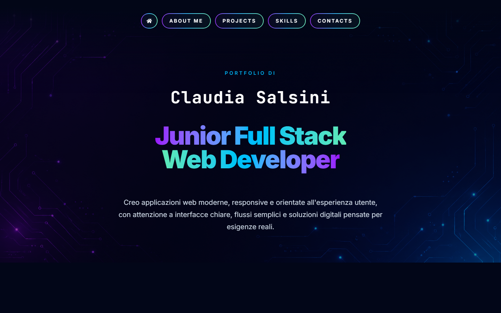
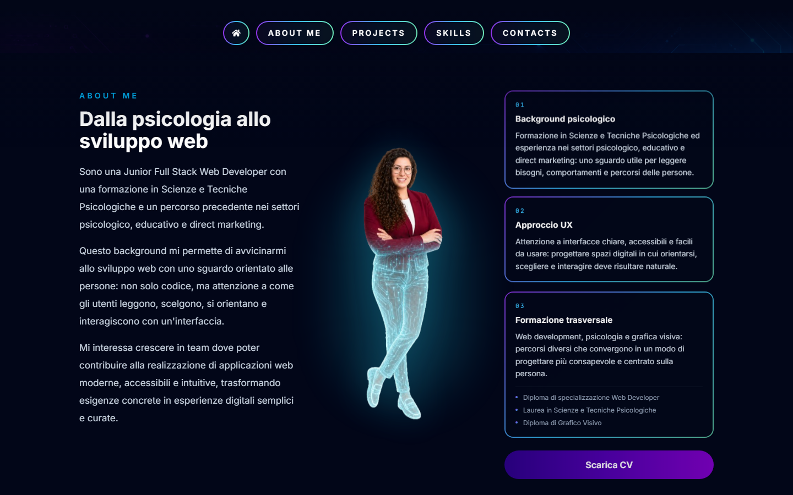
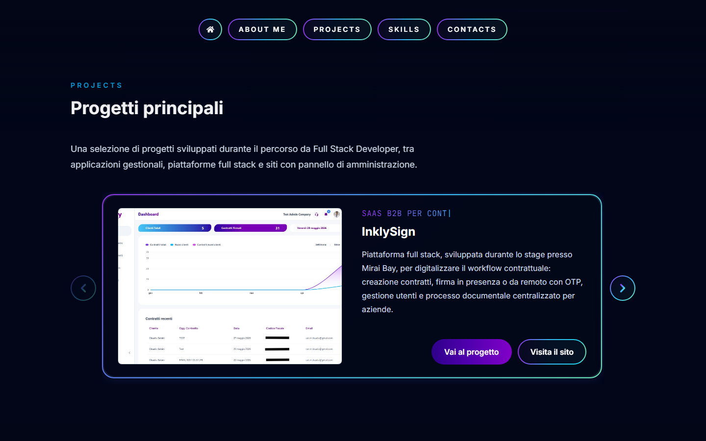
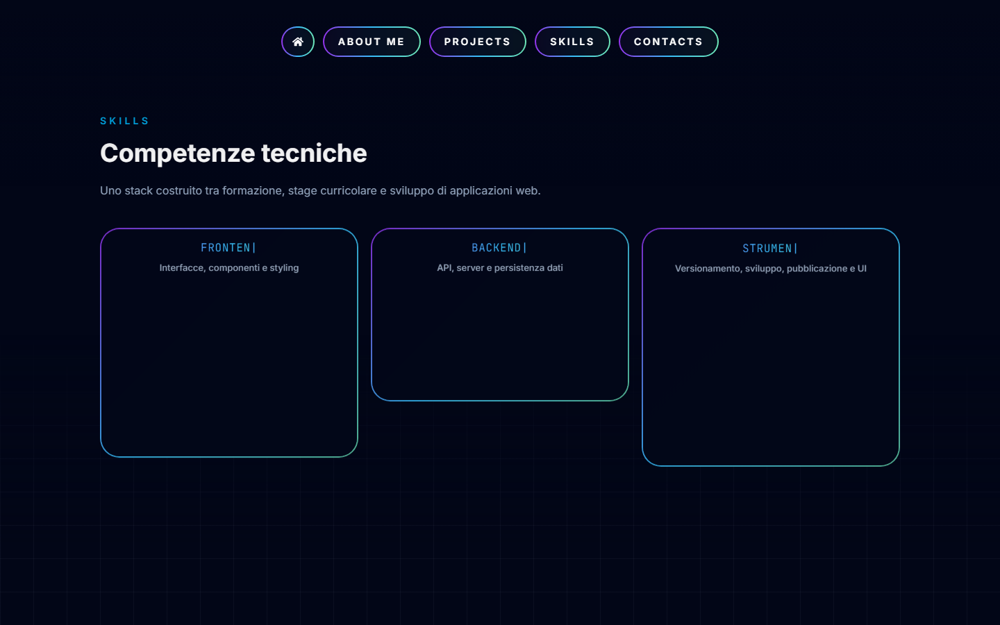
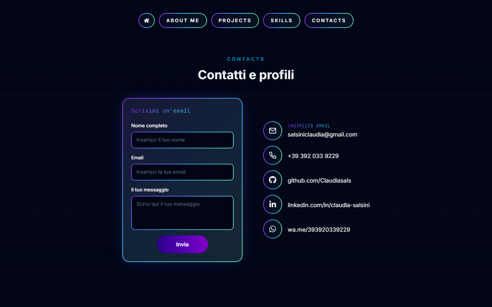
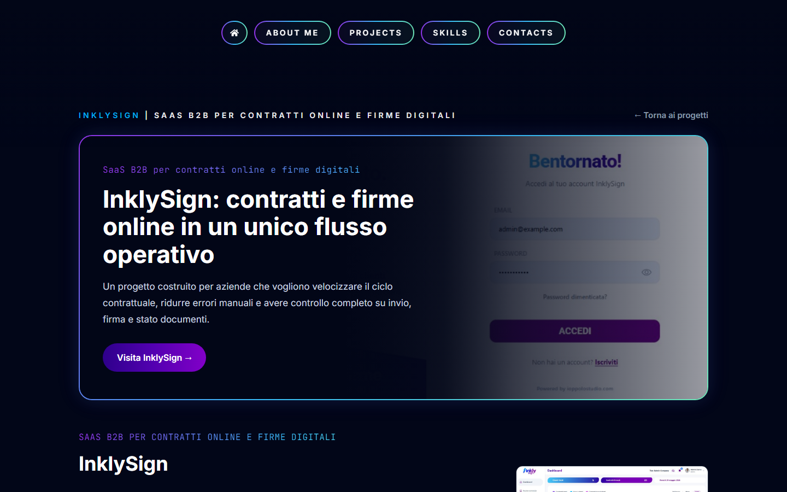
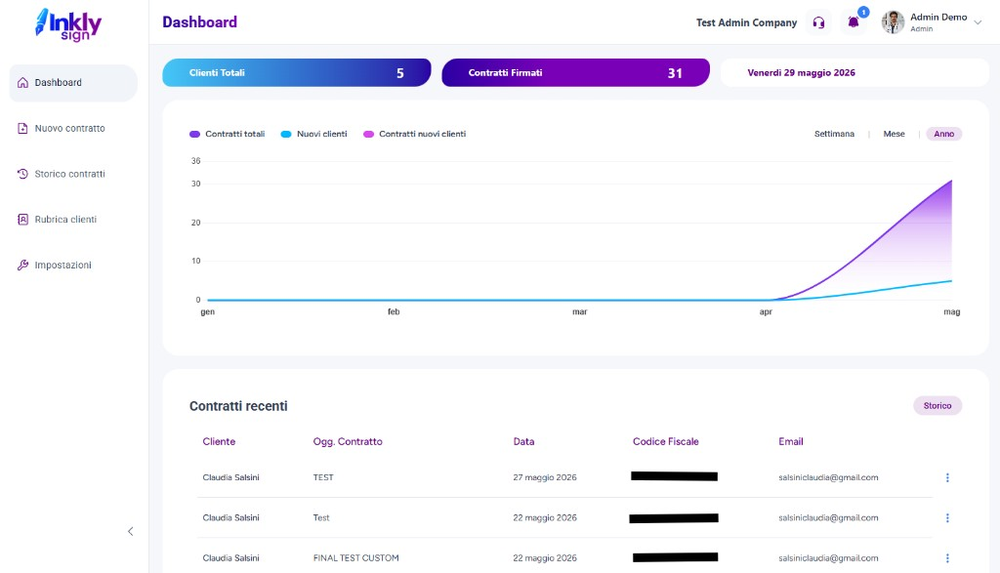
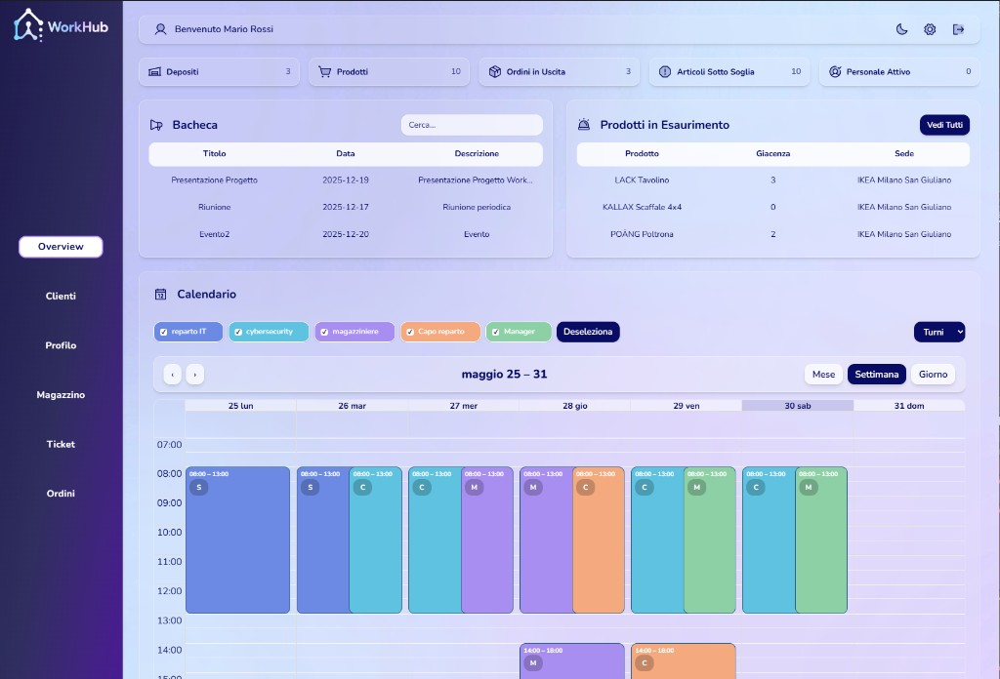
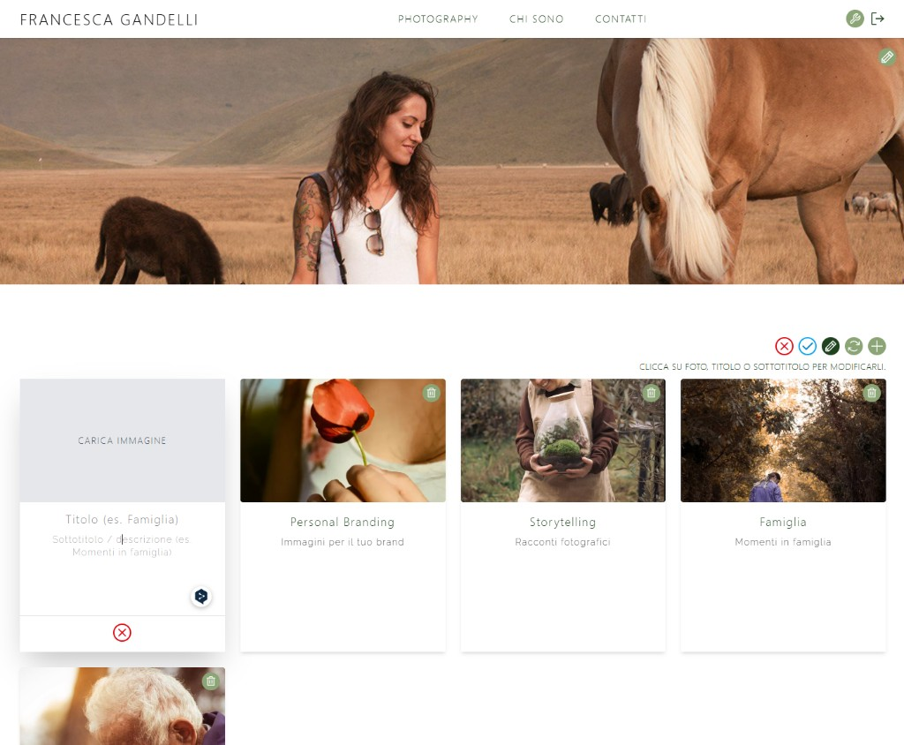

# Claudia Salsini — Portfolio

Portfolio personale di **Claudia Salsini**, Junior Full Stack Web Developer.  
Sito one-page con case study dedicati, sezione competenze tecniche, form di contatto e pagine legali.



---

## Indice

- [Panoramica](#panoramica)
- [Anteprime](#anteprime)
- [Funzionalità](#funzionalità)
- [Stack tecnologico](#stack-tecnologico)
- [Progetti in evidenza](#progetti-in-evidenza)
- [Struttura del repository](#struttura-del-repository)
- [Avvio in locale](#avvio-in-locale)
- [Build e deploy](#build-e-deploy)
- [Contatti](#contatti)

---

## Panoramica

Il portfolio presenta il percorso professionale di Claudia — dalla formazione in psicologia allo sviluppo web — attraverso un’interfaccia scura, moderna e responsive, con animazioni leggere e attenzione all’esperienza utente.

**Sezioni principali**

| Sezione | Contenuto |
|--------|-----------|
| **Hero** | Presentazione e value proposition |
| **About Me** | Background, approccio UX, formazione, download CV |
| **Projects** | Carousel dei progetti principali con link a demo e repository |
| **Skills** | Competenze tecniche organizzate per area (Frontend, Backend, Tools) |
| **Contact** | Form mailto, email, telefono, GitHub, LinkedIn, WhatsApp |

Sono incluse anche pagine di **Privacy**, **Cookie** e **Termini**, oltre a **case study** dettagliati per i singoli progetti.

---

## Anteprime

### Hero


### About Me



### Projects



### Skills



### Contact



### Case study — InklySign



---

## Funzionalità

- **Routing SPA** con React Router (home, case study, pagine legali)
- **Scroll animato** verso le sezioni con offset per navbar fissa
- **Reveal on scroll** a cascata sulle sezioni principali
- **Effetto griglia con spotlight** al passaggio del mouse (Skills + Contact)
- **Cursore personalizzato** su elementi interattivi
- **Carousel progetti** orizzontale con navigazione
- **Card competenze** con bordi gradiente e mini-card per ogni tecnologia
- **Form di contatto** via `mailto:` con precompilazione del messaggio
- **Etichette con effetto digitazione** (JetBrains Mono + gradiente)
- **Design responsive** per desktop, tablet e mobile
- **Supporto `prefers-reduced-motion`** per animazioni ridotte

---

## Stack tecnologico

| Area | Tecnologie |
|------|------------|
| **Frontend** | React 19, React Router, Vite 8, Tailwind CSS 4 |
| **UI / UX** | CSS custom, Inter, JetBrains Mono, React Icons, Devicon |
| **Backend (progetti correlati)** | Node.js, Express, PHP, Laravel |
| **Database** | MySQL, MongoDB Atlas |
| **Tooling** | ESLint, npm |
| **Deploy** | Netlify (SPA redirect via `_redirects`) |

---

## Progetti in evidenza

| Progetto | Descrizione | Link |
|----------|-------------|------|
| **InklySign** | SaaS B2B per contratti online e firme digitali | [inklysign.it](https://inklysign.it/login) |
| **WorkHub** | Gestionale interno full stack | [GitHub](https://github.com/Claudiasals/workhub.git) |
| **Francesca Gandelli** | Portfolio fotografico con pannello admin | [Demo](https://francescagandelli.netlify.app/) |

Anteprime incluse nel sito:

<p align="center">
  
  
  
</p>

---

## Struttura del repository

```
claudia-salsini-portfolio/
├── docs/
│   └── screenshots/          # Anteprime per README e documentazione
├── public/
│   ├── images/               # Asset statici (hero, about, progetti)
│   └── cv-claudia-salsini.pdf
├── scripts/
│   └── capture-readme-screenshots.mjs
├── src/
│   ├── components/           # UI riutilizzabili (Hero, About, Projects, Skills, Contact…)
│   ├── data/                 # Progetti e categorie skill
│   ├── hooks/                # Scroll spotlight, typing label
│   ├── pages/                # Home, legal, case study progetti
│   ├── utils/
│   ├── App.jsx
│   └── index.css             # Stili globali e componenti
├── index.html
├── vite.config.js
└── package.json
```

---

## Avvio in locale

**Requisiti:** Node.js 18+ consigliato, npm

```bash
# Clona il repository
git clone https://github.com/Claudiasals/claudia-salsini-portfolio.git
cd claudia-salsini-portfolio

# Installa le dipendenze
npm install

# Avvia il dev server
npm run dev
```

Apri l’URL indicato in terminale (di default `http://localhost:5173`).

### Script disponibili

| Comando | Descrizione |
|---------|-------------|
| `npm run dev` | Server di sviluppo con HMR |
| `npm run build` | Build di produzione in `dist/` |
| `npm run preview` | Anteprima locale della build |
| `npm run lint` | Controllo ESLint |

### Rigenerare gli screenshot del README

Con il dev server avviato:

```bash
npx playwright install chromium
node scripts/capture-readme-screenshots.mjs
```

Opzionale: imposta un URL diverso con `SCREENSHOT_BASE_URL=http://localhost:5173 node scripts/capture-readme-screenshots.mjs`.

---

## Build e deploy

```bash
npm run build
```

L’output viene generato nella cartella `dist/`.  
Il file `public/_redirects` gestisce il routing SPA su Netlify (`/* → /index.html`).

---

## Contatti

**Claudia Salsini** — Junior Full Stack Web Developer

- Email: [salsiniclaudia@gmail.com](mailto:salsiniclaudia@gmail.com)
- GitHub: [@Claudiasals](https://github.com/Claudiasals)
- LinkedIn: [claudia-salsini](https://www.linkedin.com/in/claudia-salsini)
- WhatsApp: [+39 392 033 9229](https://wa.me/393920339229)

---

<p align="center">
  Realizzato con React, Vite e Tailwind CSS.
</p>
